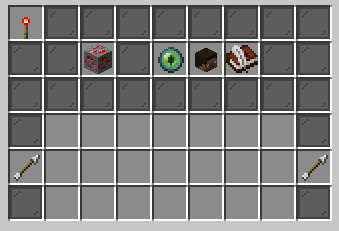
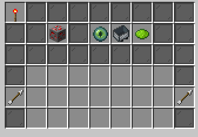

# ResidenceList

Dependencies:

- Residence
- PlaceholderAPI

## Features

- List all residence in server in a gui.
- Allow players to manage, teleport, and comment.
- Players can determine whether to display their residence in the public list.
- Players can pin their favorite residence in the list.
- Players can rate and comment on the residence.
- Players can block other player to comment or teleport to own residence.
- Admin can manage all residence in the server.

## GUI

### Residence list GUI.


> The chest at bottom middle is the icon to switch "ALL"/"PERSONAL(only show your residence)" mode.

### Residence Information GUI



- Information icon (name/description/pined)
- Comments area
- Teleport icon
- Add comment icon
- Owner head

### Residence Manage GUI



- Information icon
- Comments area
- Set teleport location icon
- Public/Private switch icon
- Blacklist manage icon

## Data Storage

Stored at `<DATA>/residences/{residence-name}.yml`.

```yaml
# MATERIAL TYPE THAT DISPLAYED IN GUI
icon: "NETHER_STAR"

# THE REGION NAME
name: "Display name"

# THE REGION DESCRIPTION
description:
  - "A nice residence region"

# WHETHER  THIS REGION SHOULD BE DISPLAYED IN PUBLIC GUI
public: false

# USER RATES TO THIS RESIDENCE
rates:
  "{user-uuid}":
    time: "2023-05-01 21:44:25"
    recommend: true
    content:
      - "A good region that very beautiful."
      - "I like it."

# BLOCKED USERS WHO CANNOT COMMENT AND SEE THIS REGION
blocked:
  - "{user-uuid}"
```

## User Data

Stored at `<DATA>/users/{user-uuid}.yml`.

```yaml
pined:
  - "A-Res"
  - "B-Res"
```