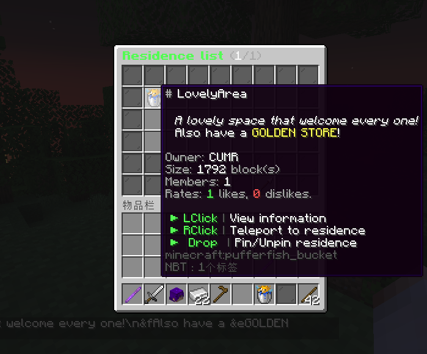

```text
   ___          _    __                 __   _     __ 
  / _ \___ ___ (_)__/ /__ ___  _______ / /  (_)__ / /_
 / , _/ -_|_-</ / _  / -_) _ \/ __/ -_) /__/ (_-</ __/
/_/|_|\__/___/_/\_,_/\__/_//_/\__/\__/____/_/___/\__/ 
```

README LANGUAGES [ [English](README.md) | [**中文**](README_CN.md)  ]


[](https://github.com/ArtformGames/ResidenceList/releases)
[](https://github.com/ArtformGames/ResidenceList/actions/workflows/maven.yml)


# **ResidenceList** (领地列表)

> 将 **"领地"** 全部 **列出** !

一款将服务器里现有的领地以图形化界面列出，并允许玩家管理、传送和评分评论的插件。

> 本插件已在 [SpigotMC](https://www.spigotmc.org/resources/residencelist-great-residence-all-listed-in-gui.113431/) 与 [Modrinth](https://modrinth.com/plugin/residencelist) 上发布。


## 功能 & 优势

- 在图形化界面中列出所有的领地 !
- 允许玩家编辑领地的昵称、描述、图标和公开状态 !
- 允许玩家置顶他们喜欢的领地 !
- 允许玩家对其他领地作出 评分 & 评论 !
- 管理员可以在一个图形化界面中管理所有领地 !

## 游戏内截图




## 依赖

- **[必须]** 领地数据基于 [Residence](https://www.zrips.net/residence/) 。
- **[推荐]** 变量部分基于 [PlaceholderAPI](https://www.spigotmc.org/resources/6245/)  实现，安装后可正常使用PAPI变量。

详细依赖列表可见  [Dependencies](https://github.com/ArtformGames/ResidenceList/network/dependencies) 。

## 指令

### 玩家指令

主指令为 `/ResidenceList` or `/reslist` 。

```text
# help
- 查看指令帮助。

# open [玩家ID]
- 打开主页面。
- 输入玩家ID可指定打开该玩家的领地页面。

# info <领地名称>
- 查看该领地的详细信息。

# edit <领地名称>
- 打开领地信息编辑页面。
```

### 管理员指令

主指令为 `/ResidenceListAdmin` or `/reslistadmin`，需要权限 `residencelist.admin` 。

```text
# open [玩家ID]
- 以管理员身份打开主界面。
- 输入玩家ID可指定打开该玩家的领地页面。

# edit <领地名称>
- 以管理员身份打开领地信息编辑页面。

# reload
- 重载配置文件。
```

## 变量

变量部分基于 [PlaceholderAPI](https://www.spigotmc.org/resources/6245/) 实现，安装后可正常使用PAPI变量。

```text
# %residencelist_status_<residence>%
- 显示领地公开状态

# %residencelist_name_<residence>%
- 显示领地昵称或领地名称 (如果未设置昵称)
```

## 配置文件

### 插件配置文件 (`config.yml`)

将在服务器首次启动时生成。您可以 [在这里](https://github.com/ArtformGames/ResidenceList-Translations) 找到该配置文件的中文译本。

### 消息配置文件 (`messages.yml`)

将在服务器首次启动时生成。您可以 [在这里](https://github.com/ArtformGames/ResidenceList-Translations) 找到该配置文件的中文译本。

## 权限

```text
# ResidenceList.admin
- 使用管理员指令与管理员功能的权限。
```

## 统计信息

[](https://bstats.org/plugin/bukkit/ResidenceList/19709)

## 开源协议

本项目源码采用 [GNU General Public License v3.0](https://opensource.org/licenses/GPL-3.0) 开源协议。

<details>
  <summary>关于 GPL 协议</summary>

> GNU General Public Licence (GPL) 有可能是开源界最常用的许可模式。GPL 保证了所有开发者的权利，同时为使用者提供了足够的复制，分发，修改的权利：
>
> #### 可自由复制
> 你可以将软件复制到你的电脑，你客户的电脑，或者任何地方。复制份数没有任何限制。
> #### 可自由分发
> 在你的网站提供下载，拷贝到U盘送人，或者将源代码打印出来从窗户扔出去（环保起见，请别这样做）。
> #### 可以用来盈利
> 你可以在分发软件的时候收费，但你必须在收费前向你的客户提供该软件的 GNU GPL 许可协议，以便让他们知道，他们可以从别的渠道免费得到这份软件，以及你收费的理由。
> #### 可自由修改
> 如果你想添加或删除某个功能，没问题，如果你想在别的项目中使用部分代码，也没问题，唯一的要求是，使用了这段代码的项目也必须使用
> GPL 协议。
>
> 需要注意的是，分发的时候，需要明确提供源代码和二进制文件，另外，用于某些程序的某些协议有一些问题和限制，你可以看一下
> @PierreJoye 写的 Practical Guide to GPL Compliance 一文。使用 GPL
> 协议，你必须在源代码代码中包含相应信息，以及协议本身。
>
> *以上文字来自 [五种开源协议GPL,LGPL,BSD,MIT,Apache](https://www.oschina.net/question/54100_9455) 。*
</details>

## 支持与致谢

该项目由 [Artfrom Games](https://github.com/ArtformGames/) 提供技术支持。


十分感谢 JetBrains 为本项目开发提供IDE及其对开源项目的大力支持。

[](https://www.jetbrains.com/?from=https://github.com/ArtformGames/VotePass)